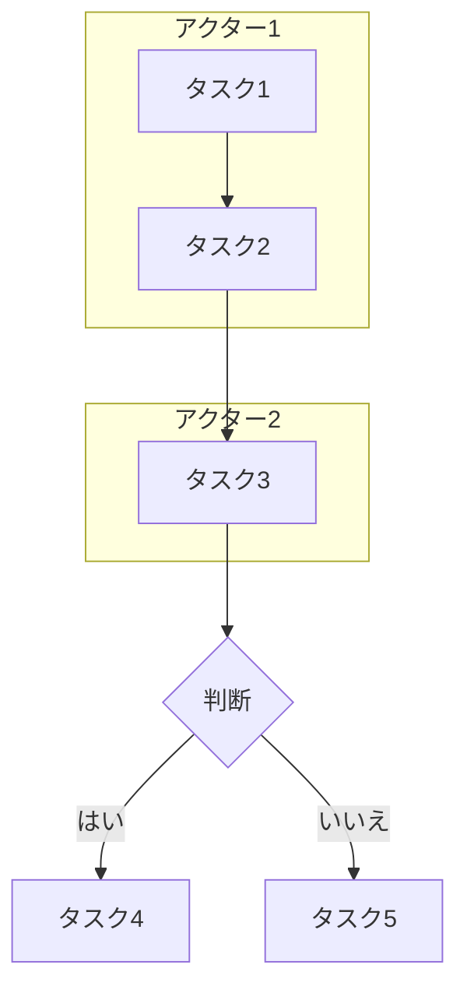

# 業務フロー自動生成 Skill

業務分析の専門家として、あらゆる業務情報（議事録、手順書、メモ等）から包括的な業務フローを抽出・可視化する。
8つの品質ポイントに完全準拠し、Miro出力用の高品質なJSONを生成する。

---

## 入力

業務情報（テキスト、Markdown、またはファイルのパス）
- ヒアリング議事録、業務マニュアル、手順書、箇条書きメモ、既存フローの文字起こし等

---

## 処理手順

### Phase 1: 業務情報の分析

以下の要素を抽出:

#### A. 登場人物（アクター）
- 部署名、役職、担当者名
- 外部関係者（顧客、ベンダー等）
- システム・ツール（使用するITシステム）

#### B. 業務プロセス
- タスクの流れ（時系列順）
- 各タスクの実行者（どの部署・スイムレーンか）
- タスク間の依存関係
- 判断分岐点（承認/差し戻し、合否判定など）
- 並行処理の有無

#### C. 関連要素
- 使用するドキュメント（申請書、報告書等）
- 使用するシステム（基幹システム、ツール等）
- データの流れ、承認フロー

#### D. タイミング情報
- 所要時間、期限、トリガーとなるイベント

---

### Phase 2: 業務フローの構造化

抽出した情報を以下のJSON形式で整理:

```json
{
  "業務名": "string",
  "目的": "string",
  "アクター": [
    { "名前": "string", "役割": "string", "種別": "部署|役職|システム" }
  ],
  "プロセス": [
    {
      "ステップID": "string",
      "タスク名": "string",
      "実行者": "string",
      "内容": "string",
      "使用ドキュメント": ["string"],
      "使用システム": ["string"],
      "所要時間": "string",
      "次のステップ": ["string"],
      "条件分岐": { "条件": "string", "真の場合": "string", "偽の場合": "string" }
    }
  ],
  "ドキュメント": [
    { "名前": "string", "用途": "string", "作成者": "string" }
  ],
  "システム": [
    { "名前": "string", "用途": "string", "利用者": ["string"] }
  ]
}
```

---

### Phase 3: Mermaid図の生成

スイムレーン形式のMermaid図を生成:



**Mermaid図のルール:**
- アクターごとにsubgraph / タスクは `[タスク名]` / 判断は `{判断内容}`
- ドキュメントは `[/ドキュメント名/]` / システムは `[(システム名)]`
- 差し戻しは点線 `-.->` で表現

---

### Phase 4: Miro出力用JSON生成（最重要）

**8つの品質ポイントに完全準拠**したJSON形式を生成する。

---

## 8つの品質ポイント

### ① 座標計算: 50pxグリッド整列

```
x = Math.round(値 / 50) * 50
y = Math.round(値 / 50) * 50
```
- 原点は左上 (0, 0)、すべての座標値は50の倍数
- すべての要素がスイムレーン範囲内に収まること

### ② 最小間隔: 重複禁止

```
カード間水平: 350px以上（中心間）
カード間垂直: 150px以上
アイコン間: 200px以上
カード⇔アイコン: 250px以上
```

### ③ 差戻し構造: ループ管理

**差し戻しキーワード:** `差し戻し`、`不可`、`不合格`、`却下`

| 種類 | 形状 | 色 | 線種 | 接続位置 |
|------|------|-----|------|---------|
| 通常フロー | elbowed | #4169e1（青） | normal | right→left or bottom→top |
| 差し戻し | curved | #e74c3c（赤） | dashed | left→left |

### ④ タイムライン: 左から右

時系列は左→右（X座標が増加する方向）。350pxピッチでカラムを配置。

```
Column 1: x=200, Column 2: x=550, Column 3: x=900, Column 4: x=1250 ...
```
- 通常フロー: from.x < to.x / 差し戻し: to.x < from.x（例外として許可）

### ⑤ 部門別カラー

**部署ごとのカラーコード（hex形式のみ）:**

| 部署 | fillColor | borderColor |
|------|-----------|-------------|
| 営業部 | #e0f2ff | #4169e1 |
| 企画部 | #fff4e0 | #ff9800 |
| 経営層 | #ffe0f0 | #e91e63 |
| 総務部 | #f0e0ff | #9c27b0 |
| 開発部 | #e0fff0 | #4caf50 |
| 品質管理部 | #ffe0e0 | #f44336 |
| 製造部 | #e0ffff | #00bcd4 |
| IT部門 | #f5f5f5 | #607d8b |
| 経理部 | #e8f5e9 | #388e3c |

**その他の要素:**

| 要素 | fillColor | borderColor |
|------|-----------|-------------|
| 判断ノード（ひし形） | #fffacd | #ffd700 |
| ドキュメントアイコン | #d5f5d5 | #4caf50 |
| システムアイコン | #e8d9ff | #9c27b0 |

### ⑥ 実行順序

各カードのmetadataに `executionOrder` を付与。トポロジカルソート順。差し戻しエッジは除外。

### ⑦ チェックリスト

```
□ すべての座標が50の倍数
□ すべてのカードがスイムレーン範囲内
□ カード間の最小間隔（350px以上）が確保
□ ドキュメント/システムアイコンがカードと重ならない
□ コネクタのfromとtoがすべて有効なカードIDを参照
□ 差し戻しコネクタに判断ノードが関与
□ タイムライン順序が正しい（差し戻し以外は左→右）
```

### ⑧ レイヤー構造

1. スイムレーン（フレーム） → 最背面
2. コネクタ（矢印） → 中間
3. シェイプ（カード・アイコン） → 最前面

※ エクスポーターがz-orderを自動管理（全シェイプPATCH）

---

## Miro JSON仕様

### 全体構造

```json
{
  "業務名": "プロセス名",
  "layout": { "swimlane_width": 6200, "swimlane_center_x": 3100 },
  "swimlanes": [...],
  "connectors": [...],
  "documents": [...],
  "systems": [...]
}
```

- `swimlane_width`: カード数に応じて調整（10個以下=3000px、15個以上=6000px+）

### swimlanes

- height: 300px（標準）、gap: 100px
- card.y = swimlane.y_position + swimlane.height / 2

### cards

| type | shape | width | height |
|------|-------|-------|--------|
| task | rectangle | 220 | 120 |
| decision | rhombus | 200 | 130 |

### connectors

- `from`/`to`: cards内のidを参照
- `label`: 条件分岐時のみ付与（通常フローは空文字）
- **同一from→toペアは1本のみ**（複数条件はラベル結合）

### documents / systems（アイコン）

- **カードと同じY座標に、カードが存在しないX位置に配置**（上下配置NG）
- サイズ: 140 x 70

> 詳細仕様は `refs/miro-json-spec.md` を参照

---

## レイアウト設計ガイド

### ステップ1: スイムレーンの決定

部署をY軸方向に並べる。上位から業務フローの開始に近い部署を配置。

```
最上段: フロー開始部署（例: 営業部）
中段: 処理・承認部署（例: 企画部、経営層）
下段: 実行部署（例: 開発部、品質管理部）
```

### ステップ2: タイムラインカラムの設計

```
カラム数の目安:
  5ステップ以下: 幅2000px
  10ステップ: 幅3500px
  15ステップ: 幅5500px
  20ステップ以上: 幅7000px+
```

### ステップ3: カード配置

1. 各タスクを実行部署のスイムレーンに割り当て
2. 業務フローの順序に従ってX座標を割り当て
3. 差し戻し先は必ず戻り先のX座標より左
4. 同一スイムレーンの同一X座標には1つのカードのみ

### ステップ4: アイコン配置

1. Y座標 = 関連するカードと同じスイムレーンの中心Y
2. X座標 = カードが使われていないX位置（スイムレーン右端の余白が最適）
3. カードとの間隔250px以上、コネクタの通り道を避ける

### ステップ5: コネクタ定義

1. from/to は有効なcard IDを参照
2. ラベルは条件分岐時のみ（通常フローは空文字）
3. 差し戻しラベルは明示的に記述
4. 判断ノードからは最低2本のコネクタ

---

## 出力形式

必ず以下の形式で出力:

### 1. 業務概要
**業務名** / **目的** / **関係者**

### 2. アクター一覧（テーブル形式）

### 3. プロセスステップ（各ステップの実行者・内容・ドキュメント・システム・所要時間）

### 4. フロー図（Mermaid）

### 5. Miro出力用JSON（`<details>`で折りたたみ）

### 6. 品質検証結果（8ポイント✓チェック）

### 7. 改善提案

---

## 品質検証とMiroエクスポート

JSONを出力後、以下を実行:

```bash
# 品質検証（7/7パスが必須）
node flow-validator.js <output.json>

# Miroエクスポート
node miro-exporter.js <output.json>
```

---

## 注意事項

1. **入力が不完全な場合:** 不明点を明示し、追加ヒアリングが必要な項目をリストアップ
2. **複雑なフローの場合:** サブプロセスに分割して複数の図を生成
3. **スイムレーンの幅:** カード数に応じて `layout.swimlane_width` を動的に調整

---

## 参照資料（必要時に読み込み）

品質に問題がある場合は以下を `Read` で確認:

- `refs/miro-json-spec.md` - JSON仕様の詳細定義（swimlane配置例、カードサイズ、コネクタパターン等）
- `refs/miro-api-constraints.md` - Miro API制約とエクスポーター自動処理の仕様
- `refs/json-sample.md` - 完全なJSON出力サンプル（few-shot参照用）
- `refs/common-mistakes.md` - よくある間違い12パターンと対策
