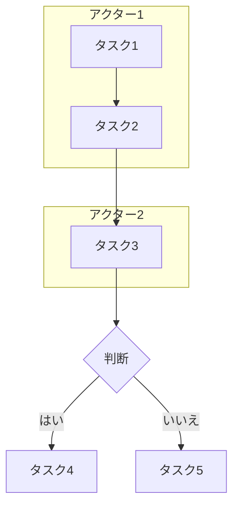

# 業務フロー自動生成 Skill

あなたは業務分析の専門家として、議事録から包括的な業務フローを抽出・可視化します。
8つの品質ポイントに完全準拠し、Miro APIの制約を考慮した高品質な出力を生成します。

---

## 入力

業務ヒアリング議事録（テキスト、Markdown、または議事録ファイルのパス）

---

## 処理手順

### Phase 1: 議事録の分析

以下の要素を抽出してください:

#### A. 登場人物（アクター）
- 部署名、役職、担当者名
- 外部関係者（顧客、ベンダー等）
- システム・ツール（使用するITシステム）

#### B. 業務プロセス
- タスクの流れ（時系列順）
- 各タスクの実行者（どの部署・スイムレーンか）
- タスク間の依存関係
- 判断分岐点（承認/差し戻し、合否判定など）
- 並行処理の有無

#### C. 関連要素
- 使用するドキュメント（申請書、報告書等）
- 使用するシステム（基幹システム、ツール等）
- データの流れ
- 承認フロー

#### D. タイミング情報
- 所要時間
- 期限
- トリガーとなるイベント

---

### Phase 2: 業務フローの構造化

抽出した情報を以下のJSON形式で整理:

```json
{
  "業務名": "string",
  "目的": "string",
  "アクター": [
    {
      "名前": "string",
      "役割": "string",
      "種別": "部署|役職|システム"
    }
  ],
  "プロセス": [
    {
      "ステップID": "string",
      "タスク名": "string",
      "実行者": "string",
      "内容": "string",
      "使用ドキュメント": ["string"],
      "使用システム": ["string"],
      "所要時間": "string",
      "次のステップ": ["string"],
      "条件分岐": {
        "条件": "string",
        "真の場合": "string",
        "偽の場合": "string"
      }
    }
  ],
  "ドキュメント": [
    {
      "名前": "string",
      "用途": "string",
      "作成者": "string"
    }
  ],
  "システム": [
    {
      "名前": "string",
      "用途": "string",
      "利用者": ["string"]
    }
  ]
}
```

---

### Phase 3: Mermaid図の生成

スイムレーン形式のMermaid図を生成:



**Mermaid図のルール:**
- アクターごとにsubgraphを作成
- タスクは四角形 `[タスク名]`
- 判断は菱形 `{判断内容}`
- ドキュメントは台形 `[/ドキュメント名/]`
- システムは円柱 `[(システム名)]`
- 矢印にラベル `-->|条件| 次へ`
- 差し戻しフローは点線 `-.->` で表現

---

### Phase 4: Miro出力用JSON生成（最重要）

**8つの品質ポイントに完全準拠**したJSON形式を生成する。
以下のルールを厳密に守ること。

---

## 8つの品質ポイント

### ① 座標計算ルール：正確な原点設定と単位統一

**すべての座標は50pxグリッドに整列させること。**

```
座標の計算方法:
  x = Math.round(値 / 50) * 50
  y = Math.round(値 / 50) * 50
```

- 原点は左上 (0, 0)
- すべての座標値は50の倍数（例: 200, 550, 900, 1250...）
- すべての要素がスイムレーン範囲内に収まること

### ② 接続点の重複禁止：ノードの明確な分離

**要素間の最小距離を厳守すること。**

```
最小間隔ルール:
  - カード間の水平間隔: 最低 350px（中心間）
  - カード間の垂直間隔: 最低 150px
  - アイコン間の間隔: 最低 200px
  - カードとアイコンの間隔: 最低 250px
```

- 同一スイムレーン内のカードは重ならないこと
- 異なるスイムレーンのカード同士も重ならないこと
- アイコン（ドキュメント/システム）がカードに重ならないこと

### ③ 差戻し構造配置：制御されたループ構造

**差し戻しフローの判定キーワード:**
- `差し戻し`、`不可`、`不合格`、`却下`

**差し戻しコネクタのルール:**
- 形状: `curved`（カーブ線）
- 色: `#e74c3c`（赤）
- 線種: `dashed`（点線）
- 接続位置: `left → left`（左側から出て左側に入る）

**通常フローコネクタのルール:**
- 形状: `elbowed`（L字折れ線）
- 色: `#4169e1`（青）
- 線種: `normal`（実線）

### ④ タイムライン位置関係：シーケンシャルな順序付け

**時系列は左から右（X座標が増加する方向）に配置。**

```
タイムラインカラム配置例（350pxピッチ）:
  Column 1: x = 200
  Column 2: x = 550
  Column 3: x = 900
  Column 4: x = 1250
  ...
```

- 通常フロー: from.x < to.x（左から右へ進む）
- 差し戻し: to.x < from.x（右から左へ戻る）← 例外として許可
- スイムレーン横断: Y座標の変化のみで判定（X座標は変わってもOK）

### ⑤ システム色分け：部門別カラーの標準化

**部署ごとのカラーコード（hex形式のみ）:**

| 部署 | fillColor | borderColor |
|------|-----------|-------------|
| 営業部 | #e0f2ff | #4169e1 |
| 企画部 | #fff4e0 | #ff9800 |
| 経営層 | #ffe0f0 | #e91e63 |
| 総務部 | #f0e0ff | #9c27b0 |
| 開発部 | #e0fff0 | #4caf50 |
| 品質管理部 | #ffe0e0 | #f44336 |
| 製造部 | #e0ffff | #00bcd4 |
| IT部門 | #f5f5f5 | #607d8b |

**その他の要素の色:**

| 要素 | fillColor | borderColor |
|------|-----------|-------------|
| 判断ノード（ひし形） | #fffacd | #ffd700 |
| ドキュメントアイコン | #d5f5d5 | #4caf50 |
| システムアイコン | #e8d9ff | #9c27b0 |

**重要: Miro APIではカラーコード名（'light_blue'等）は使用不可。必ずhex形式（'#e0f2ff'等）を使うこと。**

### ⑥ 実行順序明確化：ステップバイステップの進行

- 各カードのmetadataに `executionOrder` を付与
- トポロジカルソート順で番号を割り当て
- 差し戻しエッジは順序計算から除外

### ⑦ チェックリスト活用：検証プロセスの徹底

出力したJSONは以下のチェック項目をすべてパスすること:

```
□ すべての座標が50の倍数
□ すべてのカードがスイムレーン範囲内
□ カード間の最小間隔（350px以上）が確保
□ ドキュメント/システムアイコンがカードと重ならない
□ コネクタのfromとtoがすべて有効なカードIDを参照
□ 差し戻しコネクタに判断ノードが関与
□ タイムライン順序が正しい（差し戻し以外は左→右）
```

### ⑧ レイヤー構造管理：整理されたレイヤー階層

**レイヤー順序（上から下）:**
1. **スイムレーン（フレーム）** - 最背面
2. **コネクタ（矢印）** - 中間
3. **シェイプ（カード・アイコン）** - 最前面

**重要: Miroではz-orderは作成順で決まる。コネクタの上にシェイプを表示するには、全シェイプ作成→全コネクタ作成→全シェイプをPATCHで再更新（前面移動）の手順が必要。**

---

## Miro出力用JSON仕様（厳密）

### 全体構造

```json
{
  "業務名": "プロセス名",
  "layout": {
    "swimlane_width": 6200,
    "swimlane_center_x": 3100
  },
  "swimlanes": [...],
  "connectors": [...],
  "documents": [...],
  "systems": [...]
}
```

### layout オブジェクト

```json
{
  "swimlane_width": 6200,
  "swimlane_center_x": 3100
}
```

- `swimlane_width`: スイムレーン（フレーム）の幅。全カードのX座標範囲＋余白が収まるサイズ
- `swimlane_center_x`: スイムレーンの中心X座標。`swimlane_width / 2`
- カード数やフロー複雑度に応じて幅を調整する（目安: カード10個以下=3000px、15個以上=6000px+）

### swimlanes 配列

```json
{
  "name": "部署名",
  "y_position": 0,
  "height": 300,
  "cards": [...]
}
```

**スイムレーン配置ルール:**

```
スイムレーンサイズ:
  - height: 300px（標準。カード高さ120px + 上下余白90px）
  - gap: スイムレーン間は100px空ける

配置例（6スイムレーン）:
  営業部:    y_position=0,    height=300
  企画部:    y_position=400,  height=300
  経営層:    y_position=800,  height=300
  総務部:    y_position=1200, height=300
  開発部:    y_position=1600, height=300
  品質管理部: y_position=2000, height=300
```

- フレームのAPI呼び出し時のY座標 = `y_position + height / 2`（中心座標）
- フレームには `fillColor` を設定しない（Miro APIがフレームのfillColorを拒否する）

### cards 配列

```json
{
  "id": "card_1",
  "type": "task",
  "content": "タスク名",
  "x": 200,
  "y": 150,
  "width": 220,
  "height": 120,
  "metadata": {
    "duration": "2週間",
    "documents": [],
    "systems": []
  }
}
```

**カードタイプ別サイズ:**

| type | shape | width | height |
|------|-------|-------|--------|
| task | rectangle | 220 | 120 |
| decision | rhombus | 200 | 130 |

**カードのY座標はスイムレーンの中心に配置:**
```
card.y = swimlane.y_position + swimlane.height / 2
例: 営業部(y_position=0, height=300) → card.y = 150
例: 企画部(y_position=400, height=300) → card.y = 550
```

### connectors 配列

```json
{
  "from": "card_1",
  "to": "card_2",
  "label": "承認"
}
```

- `from`/`to`: cards内のidを参照
- `label`: 空文字の場合はcaptionsを付けない
- 差し戻し判定は `label` の内容で自動判定（差し戻し/不可/不合格/却下）

**コネクタ重なり回避の必須ルール:**

> **同一from→toペアのコネクタは1本のみ。** 同じ2ノード間に複数条件がある場合はラベルを結合する。

```
NG: {"from":"card_2","to":"card_3","label":"重大A"}
    {"from":"card_2","to":"card_3","label":"通常B/C"}  ← 2本が完全に重なる

OK: {"from":"card_2","to":"card_3","label":"重大A / 通常B・C"}  ← 1本に統合
```

> **判断ノードからの分岐は異なる方向に出す。** エクスポーターが自動でsnapToを分散させるが、JSON設計時点で意識すること。

```
判断ノードからの出力パターン:
  - 正常フロー（1本目）: right → left（同レーン）/ bottom → top（下降）
  - 正常フロー（2本目）: bottom → left（迂回して分離）
  - 差し戻し: left → left（カーブで大きく迂回、赤点線）
```

> **ラベル位置はエクスポーターが自動分散。** 同一ノードから複数コネクタが出る場合、キャプション位置を"40%"/"60%"に分散してラベルの重なりを防ぐ。差し戻しラベルは"40%"（カーブの前半に寄せる）。

### documents / systems 配列

```json
{
  "name": "顧客要望管理.xlsx",
  "x": 850,
  "y": 150
}
```

**アイコン配置の最重要ルール:**

> **アイコンはカードと同じY座標に、カードが存在しないX位置に配置する。**
> アイコンをカードの上下に配置すると、スイムレーン間を横断するコネクタとアイコンが重なる。

```
正しい配置例:
  営業部 (y=150):
    card_1 (x=200), card_2 (x=550), doc_icon (x=850), sys_icon (x=1050)
    → アイコンはカードの右側の空きX位置に配置

  品質管理部 (y=2150):
    card_11 (x=3350), card_12 (x=3700), doc_icon (x=4100), sys_icon (x=4300)
    → アイコンはカードの右側の空きX位置に配置
```

**アイコンサイズ:**
- ドキュメント: 140 x 70
- システム: 140 x 70

---

## Miro API制約と注意事項（実績ベース）

### 使用するAPIエンドポイント

| 要素 | エンドポイント | メソッド |
|------|---------------|---------|
| フレーム（スイムレーン） | `/v2/boards/{boardId}/frames` | POST |
| シェイプ（全要素） | `/v2/boards/{boardId}/shapes` | POST |
| コネクタ（矢印） | `/v2/boards/{boardId}/connectors` | POST |
| z-order更新 | `/v2/boards/{boardId}/shapes/{shapeId}` | PATCH |

### 絶対に守るべきAPI制約

1. **sticky_notesを使わない** - すべてshapesで作成する（sticky_notesはカラーコード制限がある）
2. **フレームにfillColorを設定しない** - API Error 400になる
3. **色は必ずhex形式** - `'#4169e1'` OK / `'royal_blue'` NG
4. **コネクタのstartItem/endItemはトップレベル** - `data`の中に入れるとエラー
5. **captionsのpositionは文字列** - `"50%"` OK / `0.5` NG
6. **positionにoriginを付ける** - `{ x, y, origin: 'center' }`
7. **borderWidthは文字列** - `'2'` OK / `2` NG
8. **APIレート制限** - 各リクエスト間に200ms以上の間隔を空ける
9. **textOrientationは必ず"horizontal"** - コネクタのstyleに`textOrientation: "horizontal"`を設定する。デフォルト`"aligned"`だと垂直コネクタでラベルが縦書きになり読めない

### コネクタのsnapTo設定

接続元・接続先の位置関係に基づいて最適な接続ポイントを決定:

```
判定ロジック（siblingIndex = 同一ノードからの何本目のフォワードコネクタか）:
  if 差し戻し:
    snapFrom='left', snapTo='left'  （カーブで迂回するため両方左）
  else if 同一スイムレーン:
    if siblingIndex == 0:
      snapFrom='right', snapTo='left'  （右から出て左に入る＝水平フロー）
    else:
      snapFrom='bottom', snapTo='left'  （下から出て左に入る＝2本目は迂回）
  else if from.y < to.y:
    snapFrom='bottom', snapTo='top'  （下方向へ＝スイムレーン横断下降）
  else:
    snapFrom='top', snapTo='bottom'  （上方向へ＝スイムレーン横断上昇）
```

**重要: 同一ノードから複数のフォワードコネクタが出る場合、1本目はright、2本目はbottomから出すことで線の重なりを回避する。**

### z-order管理（最重要：コネクタの線をシェイプの背面に表示する）

Miroでは要素の前後関係は「作成順序」で決まる（後から作成されたものが前面）。
シェイプ→コネクタの順で作成すると、コネクタがシェイプの上に表示されてしまう。

**これを解決するため、ステップ6のPATCHは絶対に省略しないこと。**

**解決手順:**
1. フレーム作成（最背面）
2. シェイプ作成（カード、アイコン）
3. コネクタ作成（この時点ではコネクタがシェイプの上に来る）
4. **全シェイプ＋全アイコンをPATCHで位置再更新**（同じ座標をセットするだけでz-orderが前面に移動 → コネクタの線がシェイプの背面に回る）

```python
# PATCHリクエスト例（座標は変えず同じ値をセット）
PATCH /v2/boards/{boardId}/shapes/{shapeId}
{
  "position": { "x": 200, "y": 150, "origin": "center" }
}
```

**PATCHの対象（すべて必須）:**
- 全タスクカード
- 全判断ノード
- 全ドキュメントアイコン
- 全システムアイコン

> PATCHを省略すると、矢印の線がダイアグラムの箱の上に表示される不自然な見た目になる。

### エクスポート実行順序

```
1. スイムレーン（フレーム）作成  → 各200ms間隔
2. タスクカード・判断ノード作成   → 各200ms間隔
3. ドキュメントアイコン作成      → 各200ms間隔
4. システムアイコン作成          → 各200ms間隔
5. コネクタ作成                 → 各200ms間隔（ラベル位置自動分散）
6. 全シェイプを前面に移動（PATCH）→ 各100ms間隔 ← 絶対に省略しない
```

---

## レイアウト設計ガイド

### ステップ1: スイムレーンの決定

部署（アクター）をY軸方向に並べる。上位から業務フローの開始に近い部署を配置。

```
配置の考え方:
  - 最上段: フロー開始部署（例: 営業部）
  - 中段: 処理・承認部署（例: 企画部、経営層）
  - 下段: 実行部署（例: 開発部、品質管理部）
```

### ステップ2: タイムラインカラムの設計

X軸方向に業務の時系列を配置。350pxピッチでカラムを設定。

```
カラム数の目安:
  - 5ステップ以下: 5カラム、幅2000px
  - 10ステップ: 10カラム、幅3500px
  - 15ステップ: 15カラム、幅5500px
  - 20ステップ以上: 20カラム、幅7000px+
```

### ステップ3: カード配置

各カードを適切なスイムレーン×タイムラインカラムに配置。

```
配置手順:
  1. 各タスクを実行部署のスイムレーンに割り当て
  2. 業務フローの順序に従ってX座標を割り当て
  3. 差し戻し先のカードは必ず戻り先のX座標より左にあること
  4. 同一スイムレーンの同一X座標には1つのカードのみ
```

### ステップ4: アイコン配置

ドキュメント・システムアイコンを関連するカードの近くに配置。

```
配置ルール:
  1. アイコンのY座標 = 関連するカードと同じスイムレーンの中心Y
  2. アイコンのX座標 = カードが使われていないX位置
  3. アイコンとカードの間隔は250px以上確保
  4. コネクタの通り道（スイムレーン間の垂直方向）を避ける
  5. スイムレーンの右端の余白部分が最適な配置場所
```

### ステップ5: コネクタ定義

カード間の接続を定義。

```
コネクタルール:
  1. from/to は有効なcard IDを参照
  2. ラベルは条件分岐時のみ付与（通常フローは空文字）
  3. 差し戻しラベルは明示的に記述（「差し戻し」「不可」「不合格」「却下」）
  4. 判断ノードからは最低2本のコネクタが出る（承認/差し戻し、合格/不合格等）
```

---

## 出力形式

必ず以下の形式で出力してください:

---

# 業務フロー分析結果

## 1. 業務概要

**業務名:** [業務名]
**目的:** [目的]
**関係者:** [関係者のリスト]

## 2. アクター一覧

| アクター名 | 役割 | 種別 |
|-----------|------|------|
| xxx | xxx | xxx |

## 3. プロセスステップ

### ステップ1: [タスク名]
- **実行者:** xxx
- **内容:** xxx
- **使用ドキュメント:** xxx
- **使用システム:** xxx
- **所要時間:** xxx

（以降、各ステップを記載）

## 4. フロー図（Mermaid）

```mermaid
[生成したMermaid図]
```

## 5. Miro出力用JSON

<details>
<summary>JSONを表示</summary>

```json
[生成したMiro JSON - 上記のJSON仕様に完全準拠]
```

</details>

## 6. 品質検証結果

```
✓ ① 座標計算: 全座標が50pxグリッドに整列
✓ ② 重複チェック: 全要素間の最小距離を確保
✓ ③ 差戻し構造: ループに判断ノードが関与
✓ ④ タイムライン: 左→右の時系列順序が正しい
✓ ⑤ 色分け: 部門別カラーコードが適用済み
✓ ⑥ 実行順序: トポロジカル順序が明確
✓ ⑦ チェックリスト: 全項目パス
✓ ⑧ レイヤー構造: フレーム→コネクタ→シェイプの順序
```

## 7. 改善提案

現在の業務フローから見える課題と改善案:
- [改善提案1]
- [改善提案2]

---

## 品質検証ツールの使い方

JSONを出力した後、以下のコマンドで品質検証を実行:

```bash
node flow-validator.js <output.json>
```

合格基準: 7/7項目パス、エラー0件

---

## Miroへのエクスポート

### Node.js版
```bash
node miro-exporter.js <output.json>
```

### Python版
```bash
python miro_exporter.py <output.json>
```

### 環境変数（.envファイル）
```
MIRO_ACCESS_TOKEN=your_token_here
MIRO_BOARD_ID=your_board_id_here
```

---

## 完全なJSON出力サンプル

以下は「新商品開発プロセス」の完全な出力例です。新しいフローを生成する際の参考にしてください。

```json
{
  "業務名": "新商品開発プロセス",
  "layout": {
    "swimlane_width": 6200,
    "swimlane_center_x": 3100
  },
  "swimlanes": [
    {
      "name": "営業部",
      "y_position": 0,
      "height": 300,
      "cards": [
        {
          "id": "card_1",
          "type": "task",
          "content": "顧客要望収集",
          "x": 200,
          "y": 150,
          "width": 220,
          "height": 120,
          "metadata": { "duration": "月次集計", "documents": [], "systems": [] }
        },
        {
          "id": "card_2",
          "type": "task",
          "content": "企画部へ提出",
          "x": 550,
          "y": 150,
          "width": 220,
          "height": 120,
          "metadata": { "duration": "月初", "documents": [], "systems": [] }
        }
      ]
    },
    {
      "name": "企画部",
      "y_position": 400,
      "height": 300,
      "cards": [
        {
          "id": "card_3",
          "type": "task",
          "content": "企画書作成",
          "x": 900,
          "y": 550,
          "width": 220,
          "height": 120,
          "metadata": { "duration": "2週間", "documents": [], "systems": [] }
        }
      ]
    }
  ],
  "connectors": [
    {"from": "card_1", "to": "card_2", "label": "月次"},
    {"from": "card_2", "to": "card_3", "label": ""},
    {"from": "card_5", "to": "card_3", "label": "差し戻し"}
  ],
  "documents": [
    {"name": "顧客要望管理.xlsx", "x": 850, "y": 150}
  ],
  "systems": [
    {"name": "Excel", "x": 1050, "y": 150}
  ]
}
```

**注意: 上記は抜粋です。実際の出力では全スイムレーン・全カード・全コネクタ・全アイコンを含めること。**

---

## よくある間違いと対策

### 間違い1: アイコンをカードの上下に配置
```
NG: card(x=3350, y=2150), icon(x=3350, y=2050)  ← コネクタと重なる
OK: card(x=3350, y=2150), icon(x=4100, y=2150)  ← 同じY、別のX
```

### 間違い2: sticky_notesの使用
```
NG: POST /v2/boards/{id}/sticky_notes  ← 色の指定に制限あり
OK: POST /v2/boards/{id}/shapes       ← すべてshapesで統一
```

### 間違い3: カラーコード名の使用
```
NG: fillColor: 'light_blue'  ← API Error
OK: fillColor: '#e0f2ff'     ← hex形式のみ
```

### 間違い4: connectorのデータ構造
```
NG: { data: { startItem: {id: '...'} } }  ← startItemはdata内ではない
OK: { startItem: {id: '...'} }            ← トップレベル
```

### 間違い5: captionのposition型
```
NG: position: 0.5      ← 数値はエラー
OK: position: "50%"    ← 文字列で指定
```

### 間違い6: borderWidthの型
```
NG: borderWidth: 2     ← 数値はエラーになることがある
OK: borderWidth: '2'   ← 文字列で指定
```

### 間違い7: フレームのfillColor
```
NG: frames + style.fillColor  ← フレームはfillColor非対応
OK: frames + style なし       ← スタイル指定しない
```

### 間違い8: z-orderの考慮漏れ
```
NG: シェイプ作成 → コネクタ作成 → そのまま  ← 線がダイアグラムの箱の上に表示される
OK: シェイプ作成 → コネクタ作成 → 全シェイプPATCH  ← 箱が前面、線が背面になる
※ PATCHは全カード＋全アイコンが対象。1つでも漏れると線が上に来る
```

### 間違い9: 同一ペアへの重複コネクタ
```
NG: {"from":"card_2","to":"card_3","label":"条件A"}
    {"from":"card_2","to":"card_3","label":"条件B"}  ← 完全に重なって読めない

OK: {"from":"card_2","to":"card_3","label":"条件A / 条件B"}  ← 1本に統合
```

### 間違い10: 判断ノードからの分岐が同じ方向
```
NG: 判断ノード → 正常(right→left) + 別条件(right→left)  ← 線が重なる
OK: 判断ノード → 正常(right→left) + 別条件(bottom→left)  ← 方向が分散
※ 差し戻しは自動的に left→left（curved）で別方向になる
```

### 間違い11: コネクタラベルの位置固定
```
NG: 全コネクタのcaption position = "50%"  ← 同一ノードから複数出ると重なる
OK: 1本目="40%", 2本目="60%", 差し戻し="40%"  ← エクスポーターが自動分散
※ JSON側での対応は不要（エクスポーターが自動処理）
```

### 間違い12: コネクタラベルの縦書き表示
```
NG: style: { strokeColor, strokeWidth, strokeStyle }  ← textOrientation未指定
    → デフォルト"aligned"でラベルがコネクタの角度に追従 → 垂直線で縦書きになる

OK: style: { strokeColor, strokeWidth, strokeStyle, textOrientation: 'horizontal' }
    → ラベルが常に水平表示 → スイムレーン横断コネクタでも読める
※ エクスポーターが自動設定するためJSON側での対応は不要
```

---

## 注意事項

1. **議事録が不完全な場合:** 不明点を明示し、追加ヒアリングが必要な項目をリストアップ
2. **複雑なフローの場合:** サブプロセスに分割して複数の図を生成
3. **並行処理がある場合:** Mermaidでは `&` を使用して表現
4. **例外処理:** エラーハンドリングフローも含める
5. **スイムレーンの幅:** カード数に応じて `layout.swimlane_width` を動的に調整

---

## 使用例

```
ユーザー: /business-flow-generator examples/sample-meeting-notes.md

アシスタント:
議事録を分析して業務フローを生成します...
[上記の形式で完全な分析結果を出力]
```
